# NARCOSCOPE — Digital Companion for Field Drug Testing

> SIH 2026 · Problem Statement SIH26231 · Field-ready prototype

NARCOSCOPE is a field-first software companion for **existing colorimetric field-test kits**. It combines guided image capture, physical reference-card calibration, computer vision, presumptive interpretation, uncertainty handling, and tamper-evident evidence records into one auditable workflow. It does not introduce a new physical test kit or new hardware.

## Core workflow

**Existing Field Kit → Capture → Validate → Calibrate → Analyze → Pre-Lab Readiness → Seal → Verify → Sync → FSL Handoff**

### Scope clarification
The physical colorimetric kit remains the underlying field test. The NARCOSCOPE prototype is the digital layer around that test: capture guidance, reference-card handling, analysis support, evidence integrity, and downstream verification.

## Why this architecture

The system is designed around the operational needs of field testing rather than image classification alone. Each analysis can be associated with operator attribution, timestamp, device metadata, location, image hash, quality checks, interpretation, evidence integrity metadata, chain of custody, and laboratory reconciliation status.

## Field workflow

1. **Guided capture** — live quality checks for brightness, contrast, sharpness, and glare.
2. **Reference-card lock** — four-corner geometry and reaction-area framing.
3. **Backend verification** — authoritative geometry validation and optional ArUco reference-card verification.
4. **Calibration** — kit-specific reference patches and LAB color correction.
5. **Reaction analysis** — normalized ROI and CIEDE2000 color-distance analysis where a validated target profile exists.
6. **Safe interpretation** — presumptive result or **INCONCLUSIVE** when evidence is insufficient.
7. **Evidence sealing** — SHA-256 hashes, signed metadata, chain-of-custody events, and ledger receipt.
8. **Offline-first operation** — local evidence ledger with later server synchronization.
9. **Independent verification** — investigator/FSL portal and one-scan QR verification.
10. **FSL handoff** — reconciliation status without mutating the original field evidence.

## Pre-lab evidence readiness (v16)

NARCOSCOPE adds a **pre-lab evidence readiness** gate between field testing and downstream laboratory handoff. It checks whether the digital field evidence package is complete enough for the next documented step: capture quality, reference-card evidence, reaction ROI, reagent kit/lot/expiry metadata, and evidence-bag linkage.

The readiness states are:
- **READY** — configured capture/documentation checks passed.
- **REVIEW_REQUIRED** — metadata is missing or needs review.
- **RECAPTURE_REQUIRED** — the captured evidence itself is not usable.

This is **not** a laboratory acceptance decision, does not decide whether a sample must be sent to a laboratory, and does not confirm substance identity. It is a field-evidence completeness/readiness check intended to reduce avoidable rework before handoff.

## Key capabilities

- Live capture quality gate
- Reference-card geometry and reaction ROI
- Backend ArUco verification
- Kit-specific color calibration
- CIEDE2000 color comparison
- Conservative anti-spoof/re-photography screening
- Presumptive / INCONCLUSIVE gating
- SHA-256 evidence hashing
- Signed evidence metadata
- Hash-chained offline ledger
- Server-side sync with conflict protection
- Audit replay
- Investigator/FSL verification portal
- One-scan QR verification
- Evidence packet export
- Role-aware API boundary
- Automated Python + Node validation

## Architecture

The architecture is intentionally **evidence-first**: the system does not stop at image analysis. A physical field test is converted into a controlled capture, a calibrated analysis, a sealed evidence record, and an independently verifiable handoff.

```mermaid
flowchart LR
    subgraph FIELD["Field Layer"]
        KIT["Physical Test Kit"]
        META["Reagent QR<br/>Kit / Lot / Expiry"]
        BAG["Evidence Bag ID"]
        APP["Field Capture App"]
        COACH["Live Capture Coach"]
        LOCK["Reference Card Lock"]
        ROI["Reaction ROI"]
        KIT --> META
        KIT --> BAG
        META --> APP
        BAG --> APP
        APP --> COACH --> LOCK --> ROI
    end

    subgraph VISION["Vision & Analysis Layer"]
        API["Vision API<br/>FastAPI"]
        Q["Quality Gate"]
        GEO["Geometry Validation<br/>+ Homography"]
        ARUCO["ArUco Reference-Card Check"]
        CAL["Kit-Specific Calibration"]
        LAB["LAB / CIEDE2000<br/>Color Analysis"]
        SAFE["Uncertainty Gate"]
        API --> Q --> GEO --> ARUCO --> CAL --> LAB --> SAFE
    end

    subgraph EVIDENCE["Evidence & Integrity Layer"]
        REC["Evidence Record"]
        HASH["SHA-256 + Signed Metadata"]
        LEDGER["Offline / Hash-Chained Ledger"]
        COC["Chain of Custody"]
        REC --> HASH
        REC --> COC
        HASH --> LEDGER
    end

    subgraph VERIFY["Verification & Handoff Layer"]
        SYNC["Evidence Sync"]
        QR["QR / Manual Verification"]
        AUDIT["Audit Replay"]
        PORTAL["Investigator / FSL Portal"]
        FSL["FSL Reconciliation"]
        PACKET["Evidence Packet"]
        SYNC --> QR
        SYNC --> AUDIT
        SYNC --> PORTAL --> FSL
        PORTAL --> PACKET
    end

    ROI --> API
    SAFE -->|Presumptive / INCONCLUSIVE| REC
    LEDGER --> SYNC
```



### End-to-end data flow

```text
Physical Test
    ↓
Controlled Capture
    ↓
Quality + Geometry Gate
    ↓
Reference Card Verification
    ↓
Kit Calibration
    ↓
LAB / CIEDE2000 Analysis
    ↓
Evidence Sufficiency Check
    ├── insufficient → INCONCLUSIVE
    └── sufficient   → Presumptive Interpretation
                              ↓
                       Evidence Record
                              ↓
                 Hash + Signature + Chain of Custody
                              ↓
                     Offline Ledger / Sync
                              ↓
             ┌────────────────┼────────────────┐
             ↓                ↓                ↓
        Audit Replay     QR Verification    FSL Handoff
```

### Evidence lifecycle

```text
CAPTURED → CALIBRATED → ANALYZED → SEALED → SYNCED
                                  │
                                  ├── VERIFY
                                  ├── AUDIT REPLAY
                                  └── FSL RECONCILIATION
```

### Architecture principles

- **Controlled capture before analysis** — image quality, glare, geometry, and reaction-area framing are checked before the vision pipeline proceeds.
- **Backend-authoritative verification** — browser framing assists the operator; geometry and ArUco checks are performed server-side.
- **Kit-aware analysis** — color interpretation is tied to the supplied reagent/reference profile rather than a universal drug threshold.
- **Safe uncertainty** — insufficient evidence can terminate in **INCONCLUSIVE** instead of forcing a binary result.
- **Evidence as a first-class object** — image hash, device/context metadata, interpretation, chain of custody, integrity metadata, and reconciliation status travel together.
- **Offline-first operation** — field records can be retained locally and synchronized later with conflict protection.
- **Independent verification** — investigators/FSL personnel can verify integrity without reclassifying the substance.

See [`docs/architecture/NARCOSCOPE_ARCHITECTURE.md`](docs/architecture/NARCOSCOPE_ARCHITECTURE.md) for the expanded architecture diagram and layer-by-layer design.

## Prototype boundary

The output is **presumptive** and is not a replacement for laboratory confirmation or certified forensic testing. Current implementation demonstrates the field workflow, evidence integrity, verification, and engineering contracts. It does **not** establish forensic substance-identification accuracy.

A production forensic claim requires a kit-specific, laboratory-confirmed validation program covering representative field images, multiple devices and lighting conditions, kit/lot variation, blinded evaluation, acceptance thresholds, sensitivity, specificity, false-positive/false-negative rates, inconclusive rate, calibration error, confidence intervals, and independent technical/forensic review.

Important boundaries:
- CIEDE2000 is a generic color-difference method; operational thresholds must come from validated kit profiles.
- Backend ArUco verifies the reference card; it does not identify a drug.
- Browser card framing is a capture aid; backend validation is authoritative.
- Controlled demo scenarios validate workflow/security contracts, not forensic model accuracy.
- Production identity should use real authentication/SSO rather than client-supplied role metadata.

## Repository structure

```text
SIH2026/
├── apps/
│   ├── field-app/          # React/PWA field interface
│   └── dashboard/          # Evidence/search dashboard
├── services/
│   ├── api/                # Node.js/Express backend
│   └── vision/             # Python/OpenCV vision service
├── packages/
│   ├── evidence/           # Evidence integrity utilities
│   └── shared/             # Shared schemas/types
├── data/
│   ├── sample/
│   └── schemas/
├── docs/
│   ├── architecture/
│   ├── demo/
│   └── ppt/
└── tests/
```

## Technical stack

- **Frontend:** React + Vite + PWA capabilities
- **Backend:** Node.js + Express
- **Vision:** Python + FastAPI + OpenCV
- **Persistence:** IndexedDB/local storage for offline field operation; server-side evidence store for synchronized records
- **Integrity:** SHA-256 hashing, signed record design, hash-chained ledger
- **Validation:** pytest + Node test suite + GitHub Actions
- **Deployment:** Render

## Deployment

The current Render deployment uses the following primary services:

- **Field App:** https://narcoscope-field.onrender.com
- **API:** https://sih2026-api-qk7g.onrender.com
- **Vision API:** https://sih2026-vision.onrender.com

An additional older `sih2026-field-app` Render service exists in the workspace; the `narcoscope-field` service is the primary field-app URL.

The field app is configured through:
- `VITE_API_BASE_URL`
- `VITE_VISION_API_URL`

For production, configure restricted CORS origins, real authentication, durable audit/ledger storage, managed signing-key custody, and an evidence-retention policy.

## Verification workflow

Sealed evidence records expose a compact verification QR containing only the Verification ID/Test ID.

The **#verify** route supports:
- native browser QR scanning where `BarcodeDetector` is available
- manual Verification ID entry as a fallback
- server-side evidence verification
- integrity/hash/ledger status
- evidence-bag and FSL reconciliation status

The QR never contains evidence images, private keys, or sensitive case data.

## Controlled judge/demo scenarios

1. **Clean verification** — create/sync a sealed record and verify it through the QR.
2. **Wrong identifier** — enter an unknown ID and show the review/error state.
3. **Tamper simulation** — alter a copy of a sealed record and demonstrate integrity failure.
4. **Sync conflict** — reuse a test ID with a different record hash and demonstrate HTTP 409.
5. **FSL reconciliation** — update and verify laboratory reconciliation status with an authorized role.
6. **Unsupported browser** — demonstrate manual Verification ID fallback.
7. **Poor capture** — deliberately introduce glare/blur and show the quality gate blocking capture.
8. **Insufficient evidence** — demonstrate the safe INCONCLUSIVE path.

These scenarios demonstrate application contracts and operational safety, not forensic accuracy.

## Validation

Run the automated checks locally:

```bash
cd services/vision
pytest

cd ../api
npm test
```

GitHub Actions also validates the Python vision service and Node API contracts.

See:
- `docs/VALIDATION.md`
- `docs/SIH_FINAL_JUDGE_GUIDE.md`
- `docs/demo/DEMO_SCRIPT.md`
- `docs/ppt/SIH_PPT_CONTENT.md`

## Judge-ready positioning

**One-line pitch:**

> NARCOSCOPE turns a field drug-test strip into a guided, auditable, verifiable digital evidence record — not just an image classification.

**Demo safety wording:**

> This demonstration validates the field workflow, evidence integrity and verification contracts. Forensic performance will be established through a separate laboratory-confirmed validation study.
