# NARCOSCOPE Architecture — Judge Visual

```mermaid
flowchart LR
    A[Physical Test Kit] --> B[Reagent QR + Kit/Lot/Expiry]
    A --> C[Evidence Bag ID]
    B --> D[Field App]
    C --> D
    D --> E[Live Capture Coach]
    E --> F[Reference Card Lock]
    F --> G[Card Geometry + Reaction ROI]
    G --> H[Vision API]
    H --> I[Quality Gate]
    I --> J[ArUco Verification]
    J --> K[Homography Normalization]
    K --> L[Kit-Specific Calibration]
    L --> M[LAB / CIEDE2000 Analysis]
    M --> N{Evidence Sufficient?}
    N -->|Yes| O[Presumptive Interpretation]
    N -->|No| P[INCONCLUSIVE]
    O --> Q[Evidence Record]
    P --> Q
    Q --> R[SHA-256 + Signature Metadata]
    R --> S[Offline Evidence Ledger]
    S --> T[Server Sync]
    T --> U[Verification Portal]
    U --> V[QR / Manual Verification]
    U --> W[FSL Reconciliation]
    U --> X[Evidence Packet]
    Q --> Y[Audit Replay]
```

## Layered view

### 1. Physical layer
- Colorimetric test strip/reagent
- Reference card
- Evidence bag
- Reagent and bag identifiers

### 2. Field acquisition layer
- React/PWA field interface
- Live capture quality coach
- Reference-card framing
- Reaction ROI

### 3. Vision layer
- Geometry validation
- ArUco reference-card verification
- Homography normalization
- Kit-specific LAB calibration
- CIEDE2000 analysis
- Conservative anti-spoof signal

### 4. Decision layer
- Presumptive interpretation
- Quality/validation gates
- INCONCLUSIVE path

### 5. Evidence layer
- SHA-256
- Signed metadata
- Chain of custody
- Hash-chained ledger
- Offline-first storage
- Sync conflict protection

### 6. Verification layer
- QR verification
- Investigator portal
- FSL reconciliation
- Printable evidence packet
- Audit replay

## Judge takeaway

**NARCOSCOPE is not “camera → classifier.”**

It is:

**physical test → controlled capture → calibrated analysis → uncertainty gate → sealed evidence → independent verification → FSL handoff**
